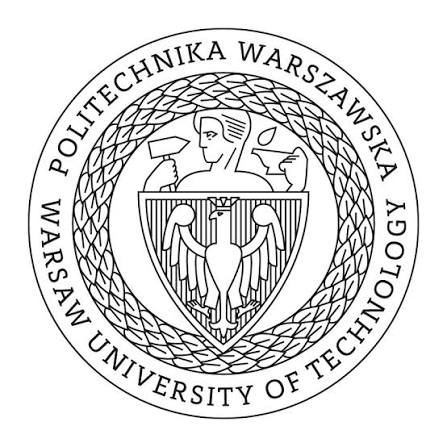

# Przemysław Feliniak

## About

Warsaw University of Technology  
B.Sc. Eng., Applied Computer Science  
Oct 2025 – Present

 

## Certifications

[AZ-900](https://learn.microsoft.com/en-us/users/przemyslawfeliniak/credentials/d50520186c12576b)

